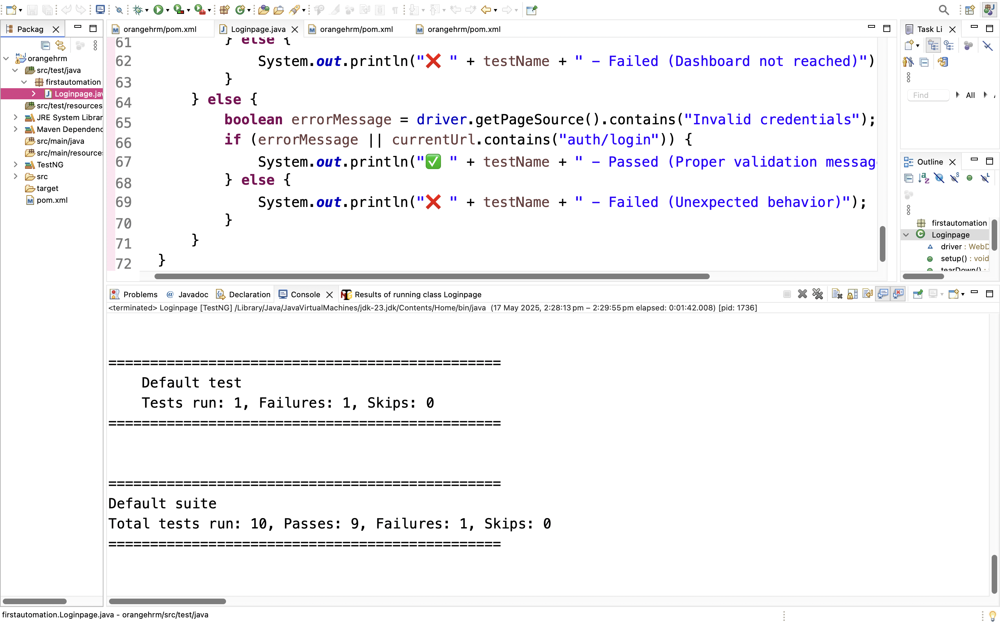
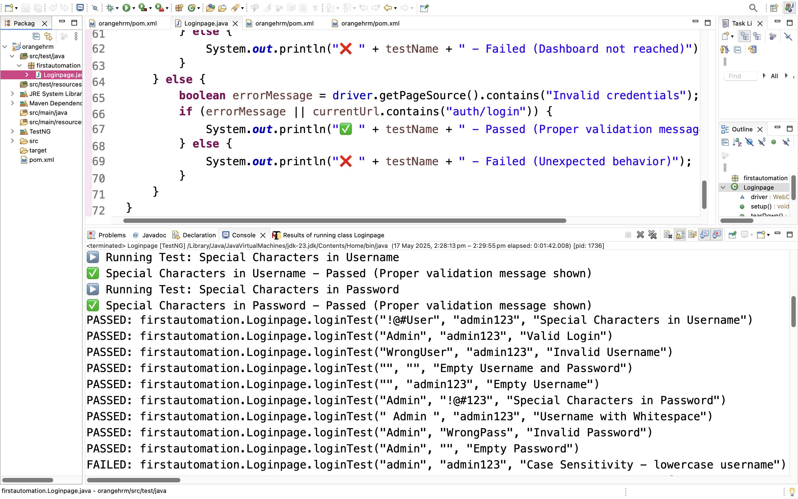

# OrangeHRM Login Automation using Selenium & TestNG

This project automates the login functionality for the OrangeHRM demo site:  
👉 [https://opensource-demo.orangehrmlive.com](https://opensource-demo.orangehrmlive.com)

## 🔧 Tech Stack
- Java
- Selenium WebDriver
- ChromeDriver
- TestNG
- WebDriverManager (recommended)

## ✅ Test Scenarios
- Valid login
- Invalid username/password
- Empty fields
- Username with whitespace
- Case sensitivity
- Special characters in credentials

## 📦 How to Run
1. Clone this repository
2. Open the project in Eclipse or IntelliJ
3. Ensure ChromeDriver is set up or use WebDriverManager
4. Run the TestNG test file (`Loginpage.java`) as a TestNG test

## 📁 Project Structure
- **`pages/`** – Page Object Model classes
- **`tests/`** – Test classes using TestNG
- **`drivers/`** – WebDriver setup (optional if using WebDriverManager)

## 📸 Screenshots

### 🔐 Login Page

### ✅ Dashboard

## 💡 Future Improvements
- Replace `Thread.sleep()` with `WebDriverWait`
- Add logging with Log4j or SLF4J
- Implement data-driven testing using Excel/CSV
- Include test reporting (e.g., ExtentReports)

## ✅ Status
- [x] Login functionality automated
- [x] TestNG integrated
- [ ] Data-driven testing
- [ ] Reporting
